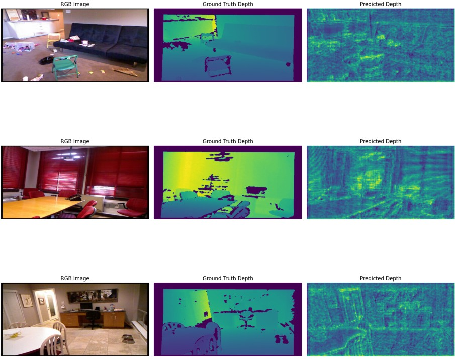

# Source-Free Domain Adaptation for Indoor Depth Estimation

A Master's thesis implementation of Test-Time Domain Adaptation (TTDA) for monocular depth estimation in indoor scenarios, focusing on bridging the virtual-to-real domain gap without requiring access to source domain data during adaptation.

---

## Overview

The primary objective of the thesis is to explore whether
synthetic data (Virtual gallery dataset) can serve as a scalable and effective source for training adaptive depth
estimation systems. More specifically, the research seeks to determine whether a model
trained using synthetic images without access to ground truth labels or target domain
camera parameters can successfully generalize to different environments using selfsupervised
TTDA techniques. The proposed system will perform supervised learning
on a synthetic dataset and later adapt at test time using only unlabeled target domain (NYU dataset)
images. This strategy avoids reliance on manual annotations, source data during
inference, or knowledge of deployment conditions, making it ideal for applications
in wearable technologie

### Key Features

- **Source-Free Adaptation**: Adapts to target domain without access to source training data  
- **Test-Time Domain Adaptation (TTDA)**: Real-time adaptation during inference  
- **Geometric Consistency Learning**: Uses random transformations and consistency constraints  
- **Teacher-Student Framework**: Employs EMA-based teacher model for stable adaptation  
- **Indoor Scene Focus**: Optimized for indoor depth estimation scenarios  

---

## Methodology

**The adaptation framework**

### Architecture Overview

The adaptation pipeline consists of three main components:

1. **Dual-Stream Processing**: Each input image undergoes two parallel paths:
   - Original image I₁ → Depth prediction D₁  
   - Geometrically transformed image I₂ → Depth prediction D₂  

2. **Geometric Transformations**: Random flipping and translation applied to create I₂, with transformation parameters T recorded for alignment  

3. **Consistency Enforcement**:
   - Spatial alignment: D₂ is inversely transformed (T⁻¹) to produce D'₂  
   - Teacher-student regularization: EMA teacher model generates D_teacher for stable guidance  

### Loss Function

The total TTDA loss combines:
- **Consistency Loss**: Enforces agreement between D₁ and D'₂ over valid pixel regions  
- **Teacher-Student Loss**: Regularizes predictions against stable EMA teacher model  

Only valid depth values are considered through dynamically generated masks.

## After Adaptation

Supervised training on Virtual Gallery dataset and then adapting it to NYU dataset (without using labels of NYU) results

