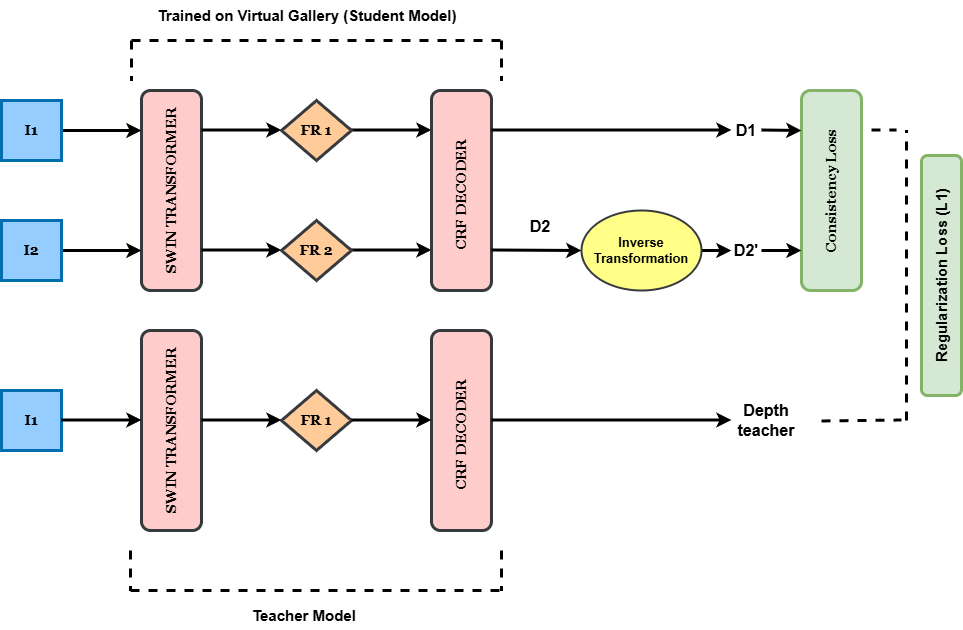

# Source-Free Domain Adaptation for Indoor Depth Estimation

A Master's thesis implementation of Test-Time Domain Adaptation (TTDA) for monocular depth estimation in indoor scenarios, focusing on bridging the virtual-to-real domain gap without requiring access to source domain data during adaptation.

---

## Overview

This repository contains the implementation of a source-free domain adaptation approach for monocular depth estimation. The method enables a model trained on synthetic indoor environment (Virtual Gallery dataset) to adapt to real-world indoor scenes at test time, without requiring the original training data.

### Key Features

- **Source-Free Adaptation**: Adapts to target domain without access to source training data  
- **Test-Time Domain Adaptation (TTDA)**: Real-time adaptation during inference  
- **Geometric Consistency Learning**: Uses random transformations and consistency constraints  
- **Teacher-Student Framework**: Employs EMA-based teacher model for stable adaptation  
- **Indoor Scene Focus**: Optimized for indoor depth estimation scenarios  

---

## Methodology

*The adaptation framework *

### Architecture Overview

The adaptation pipeline consists of three main components:

1. **Dual-Stream Processing**: Each input image undergoes two parallel paths:
   - Original image I₁ → Depth prediction D₁  
   - Geometrically transformed image I₂ → Depth prediction D₂  

2. **Geometric Transformations**: Random flipping and translation applied to create I₂, with transformation parameters T recorded for alignment  

3. **Consistency Enforcement**:
   - Spatial alignment: D₂ is inversely transformed (T⁻¹) to produce D'₂  
   - Teacher-student regularization: EMA teacher model generates D_teacher for stable guidance  

### Loss Function

The total TTDA loss combines:
- **Consistency Loss**: Enforces agreement between D₁ and D'₂ over valid pixel regions  
- **Teacher-Student Loss**: Regularizes predictions against stable EMA teacher model  

Only valid depth values are considered through dynamically generated masks.

## After Adaptation

Supervised training on Virtual Gallery dataset and then adapting it to NYU dataset results

